## 참고 자료

*  원본 : Recommender Systems The Textbook 2장- Charu C. Aggarwal
* 책에 2장(앞 부분, 2-4)까지 번역합니다.
* 중요한 부분이 아닌 것은 생략합니다. (추후에 2-5 ~ 2-8도 업로드 예정)

***

##  2장. Neighborhood-Based Collaborative Filtering

> “When one neighbor helps another, we strengthen our communities.一Jennifer Pahlka

## 요약 

- 이웃기반 접근 방법은 K-NN 분류 및 회귀 방법으로부터 영감을 얻습니다.
- 이웃을 계산하기 위해, 피어슨 상관계수(Pearson correlation coefficient) 또는 코사인(cosine)과 같은 다양한 유사도 함수를 사용합니다
- 아이템들 사이의 등급 분포는 실제 long-tail 속성으로 불립니다
    - 많은 경우, 고빈도 Item은 판매자에게 거의 이익이 되지 않는 상대적으로 경쟁력 있는(인기가 있는) Item인 경향이 있습니다
    - 판매자는 더 낮은 빈도의 Item을 추천하는 것이 유리할 수 있습니다

- 이웃기반 방법의 기본 아이디어는 User 유사도 또는 아이템 유사도를 사용하여 등급 매트릭스의 추천 리스트를 작성하는 것
    - Item 기반 방법은 종종 User 자체 등급을 사용하여 추천 리스트를 수행하기 때문에 보다 관련성이 높은 추천 리스트를 제공합니다
    - Item 기반 방법에 비해 User 기반 방법의 추천 프로세스가 다양해질수 있음, 다양성은 또한 뜻밖의 발견을 장려하는데, 다소 놀랍고 흥미로운 추천 결과가 발생
- 이웃기반 방법의 주요 문제점은 오프라인 단계의 복잡성으로 User 수나 Item 수가 매우 많은 경우
    * 클러스터링 기반 방법으로 피어 그룹을 구성하여 효율적으로 처리할 수 있습니다

*** 

### 2.1 Introduction

*  Neighborhood-Based Collaborative Filtering은 메모리 기반 알고리즘이고 협업 필터링을 위해 개발된 초기 알고리즘 중 하나
* **이웃기반 알고리즘에는 두 가지 기본 유형**이 있음
    *  *1.User-based collaborative filtering*
        * User A와 유사한 User가 제공한 등급을 가지고 추천 리스트를 만드는데 사용됨
        * A의 예상 등급은 각 "피어 그룹" 등급의 가중 평균값으로 계산
    *   *2.Item-based collaborative filtering*
        * 대상 Item B에 대한 추천 리스트를 만들기 위해 첫번째 단계는 Item B와 가장 유사한 Item의 집합 S를 결정하는 것
        * User A의 등급을 예측하기 위해 Item B에서 A가 평가한 집합 S의 등급을 가지고 결정
        * 등급의 가중 평균은 Item B에 대한 User A의 예상 등급을 계산하는 데 사용됨

*   **User-based과 Item-based 알고리즘 차이점**
    *   User-based : 등급이 User 근처 이웃의 등급 레이팅을 사용하여 예측
    *   Item-based : 등급이 User가 아이템 이웃의 등급 레이팅을 사용하여 예측

*   User X Item 평가는 **매트릭스가 m 개의 User 및 n 개의 Item을 포함하는 불완전한 m × n 매트릭스 R** 이라고 가정
    *   1.Predicting the rating value of a user-item combination
        *   추천 시스템의 가장 간단하고 기본적인 공식. Item j에 대한 User u의 누락된 점수인 r를 예측하기
    *   2.Top-k items 또는 Top-k users로 결정
        * 대부분 현실적인 설정에서 판매자는 반드시 User-Item 조합에 대한 특정 등급 값이 필요하지는 않음 
        * 오히려 특정 User에 대해 가장 관련있는 아이템인 Top K 또는 특정 item에 대해 가장 관련있는 User를 학습하는 것
        * 전통적인 추천 알고리즘에서 "top-and-problem"은 거의 항상 top-k user가 아닌 **top-k item**을 찾는 프로세스

*** 

###  2.2 Key Properties of Ratings Matrices

*   일반적으로 등급 매트릭스의 Item 중 일부 만이 지정됨. **행렬의 지정된 Item을 Train 데이터라고 하며, 행렬의 지정되지 않은 Item을 Test 데이터**
    *   해당 정의는 기계학습에서 분류, 회귀 및 지도학습 알고리즘과 직접적으로 유사함. 지정되지 않은 Item은 클래스 변수 또는 종속 변수라고 하는 특수열에 속함
    *   따라서 추천 문제는 분류 및 회귀 문제의 일반화로 볼 수 있음
    *   등급은 현재 사용 중인 응용 프로그램에 따라 다양한 방식으로 정의할 수 있음

*   *1.연속 등급*
    *  등급은 연속적인 척도로 지정
    *  연속 등급 접근법의 단점은 User에게 부담을 주는 것. 해당 접근은 비교적 흔치 않음

*   *2.간격기준 등급*
    *  간격기준 등급에서 등급은 종종 10 점 및 20 점 척도도 가능하지만 5 점 또는 7 점 척도를 주로 사용
    *  예) 1에서 5까지의 숫자 정수, -2에서 2 또는 1에서 7까지의 숫자 정수를 들 수 있음
    *  중요한 가정은 **수치가 명시적으로 등급 사이의 거리를 정의하고 등급값이 일반적으로 등거리**

*   *3.서수 등급*
    *  서수 등급은 간격기준 등급과 비슷하지만 **범주형 값을 사용할 수 있다는 점만 다름**
    *  정렬된 범주적 값의 예로는 "매우 동의하지 않음", "동의하지 않음", "중립적인", "동의함"및 "강력하게 동의함"과 같은 응답이 있음
    *  인접한 등급값의 쌍 사이의 차이는 동일. 그러나 실제적으로 차이는 단지 이론적인 것
    *  일반적으로 긍정 및 부정 응답 수는 편향을 피하기 위해 균등하게 균형을 이룹니다. 짝수개의 응답이 사용되는 경우 **중립** 옵션이 없음 
        *   중립적인 옵션이 없기 때문에 해당 접근법을 강제 선택 방법

*   *4.이진 등급*
    *   이진 등급의 경우 긍정적이거나 부정적인 답변에 해당하는 두 가지 옵션만 존재
    *   바이너리 등급은 간격 기반 및 서수 등급의 특별한 경우로 간주될 수 있음. 
        * **예를 들어 판도라 인터넷 라디오 방송국은 User에게 특정 음악 트랙을 좋아하거나 싫어하는 평가를 내리는 기능을 제공**
    *   이진 평가는 강제 선택이 User에게 부과되는 경우의 예, User가 중립인 경우 종종 평점을 지정하지 않음

*   *5.단항 등급* 
    *   User가 Item에 대한 **긍정적인 선호도를 지정할 수 있게 하지만, 부정적인 선호도를 지정하는 메커니즘은 없음**
    *   **Facebook에서 '좋아요' 버튼을 사용하는 것과 같은 환경**. 단항 등급은 고객 행동에서도 파생됩니다. 
        *  예를 들어, Item을 구매하는 고객의 행위는 Item에 대해 긍정적인 투표로 간주될 수 있음
        *   반면에, 고객이 아이템을 구입하지 않았다면 반드시 그 아이템에 대한 싫어함을 나타내는 것은 아닙니다. 단항 등급은 설정에서 특수화된 모델의 개발을 단순화하기 때문에 특별함
    *  고객이 명시적으로 피드백을 제공하지 않기 때문에 **고객 액션에서 단항 등급을 간접적으로 유도하는 것은 암시적 피드백이라고도 함**
    * 오히려 피드백은 암시적으로 고객의 행동을 통해 추론됩니다. 
    * 유형의 "등급"은 User가 명시적으로 평가하는 것보다 온라인 사이트의 Item과 상호 작용할 확률이 훨씬 높기 때문에 종종 쉽게 얻을 수 있음

*   아이템들 사이의 등급 분포는 실제 long-tail 속성으로 불림
    *  해당 속성에 따르면, Item 중 아주 작은 부분만 자주 평가됨. (주로 인기 Item)
    *  대다수의 Item은 거의 평가되지 않습니다. 이로 인해 기본 등급이 크게 왜곡되어 배포됨
    *  기울어진 등급 분포의 예가 그림에 나와 있습니다. X 축은 Item의 색인을 빈도 순서대로 표시하고 Y 축은 Item이 평가된 빈도를 나타냄
    *   대부분의 Item은 적은 횟수로 평가되는 것이 분명함, **이러한 등급 분포는 추천 프로세스에 중요한 영향을 미침**

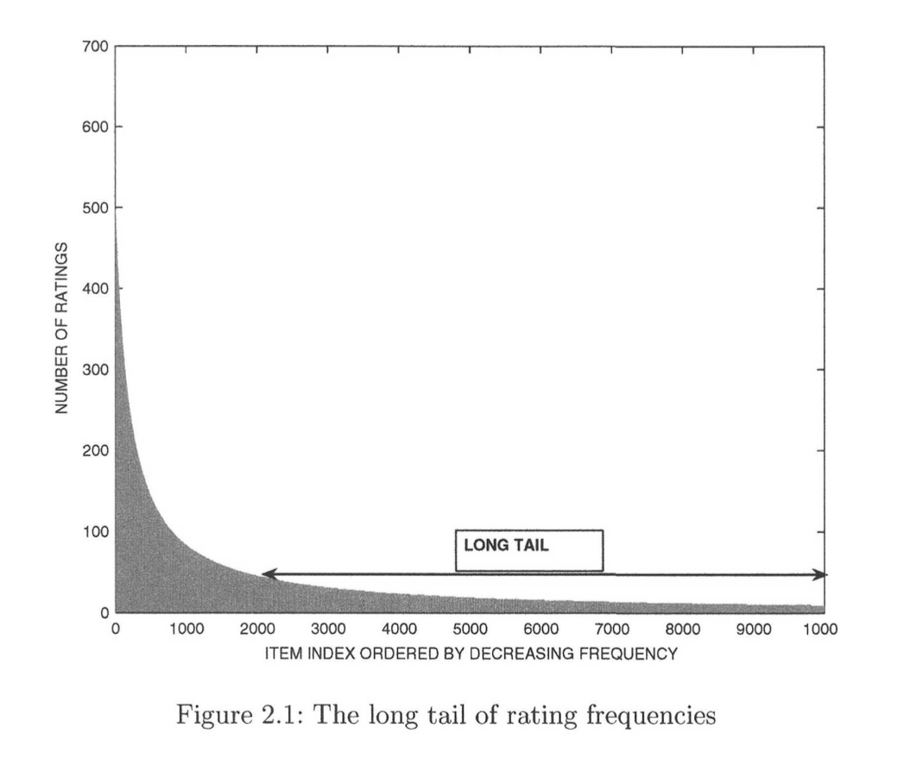 

*   1.많은 경우에 고빈도 Item은 판매자에게 거의 이익이 되지 않는 상대적으로 경쟁력 있는 Item인 경향이 있음
    *  반면에 빈도가 낮은 Item은 이윤폭이 더 큼, **판매자는 더 낮은 빈도의 Item을 추천하는 것이 유리할 수 있음**
    *  사실 [Amazon.com](http://amazon.com/)과 같은 많은 회사들이 **긴 꼬리 부분을 팔아서 이익을 얻는 것**으로 분석되었음  

*   2.긴 꼬리에서 관찰된 등급의 **드문 평가 때문에 긴 꼬리에서 강력한 등급 예측을 제공하는 것**이 일반적으로 더 어려움
    *   사실, 많은 추천 알고리즘은 드문 품목보다는 인기있는 품목을 제안하는 경향이 있음
    *   현상은 또한 다양성에 부정적인 영향을 미치고 **User는 흔히 인기있는 Item과 동일한 일련의 권장 사항을 받음으로써 지루해짐**

*   3.긴 꼬리 분포는 User가 자주 평가하는 Item의 수가 적음을 의미함 

*** 

### 2.3 Predicting Ratings with Neighborhood-Based Methods

*   **이웃기반 방법의 기본 아이디어**는 **User 유사성 또는 아이템 유사성**을 사용하여 등급 매트릭스의 추천 리스트를 작성하는 것
    *   이웃에 대한 개념은 예측을 하기 위해 **유사한 User 또는 유사한 Item**을 결정할 필요가 있음

*   1.User 기반 모델
    *   유사한 User가 동일한 Item에 대해 유사한 등급을 가짐 
    *   따라서 앨리스와 밥이 과거에 비슷한 방식으로 영화를 평가했다면 밥의 관측되지 않은 영화 평가를 예측하기 위해 영화 '터미네이터'에서 앨리스의 관측 등급을 사용할 수 있음

*   2.Item 기반 모델
    *   유사한 품목은 동일한 User에 의해 유사한 방법으로 평가
    *   Alien과 "Predator"와 같은 유사한 과학 소설 영화에 대한 Bob의 평가는 Terminator에서 자신의 평점을 예측하는 데 사용될 수 있음

*   협업 필터링 문제는 분류 / 회귀 모델링 문제의 일반화로 볼 수 있기 때문에 이웃기반 방법은 기계학습에서 K-NN 분류기의 일반화로 볼 수 있음
    *   가장 가까운 이웃들이 항상 "Row 기준 유사성"에 기초하여 결정되는 분류기와는 달리, **Row 또는 Column을 기준으로 협업 필터링에서는 가장 가까운 이웃을 찾을 수 있음**
    *   누락된 모든 Item이 분류 시 단일 Column에 집중되기 때문에 누락된 Item은 협업 필터링에서 서로 다른 Row와 Column에 분산되기 때문

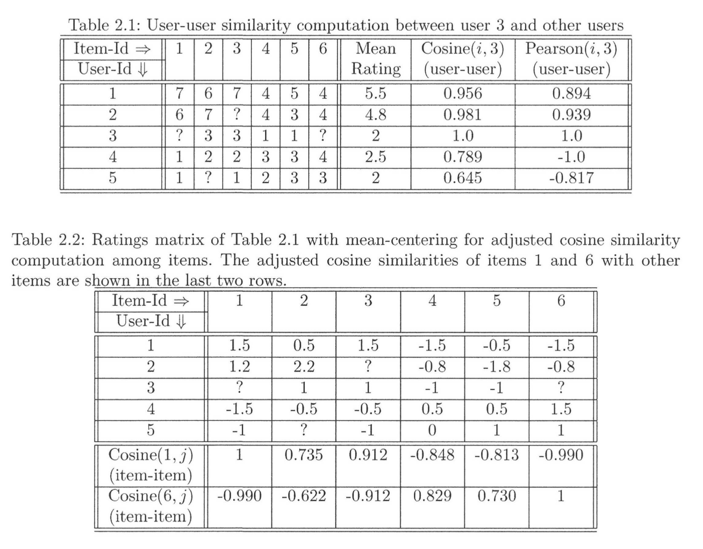 

***

###  2.3.1 User-Based Neighborhood Models

*   User 기반 이웃은 등급 예측을 계산하려고 유사한 User를 식별하기 위해 정의
    * User i의 이웃을 결정하기 위해, 모든 다른 User들에 대한 유사성이 계산 필요
    * User가 지정한 등급 사이에 유사도를 정의해야 함, 유사도 계산은 User마다 등급이 다를 수 있으므로 까다로운 작업
    * 특정 User는 대부분의 Item을 좋아하는 경향이 있는 반면, 다른 User는 대부분의 Item을 좋아하지 않는 경향이 있을 수 있음
    *  또한 여러 User가 서로 다른 Item을 평가했을 수도 있음
*   두 User u와 v의 등급 벡터 사이의 유사성 Sim (w, v)를 포착하는 한 가지 방법은 **Pearson 상관 계수**

 

* 피어슨 계수는 User와 다른 모든 User 간에 계산됨
* 목표 : **User의 피어 그룹을 정의하는 한 가지 방법은 피어슨 계수가 가장 높은 k명의 User 집합을 사용하는 것**
    *   그러나, User의 top-k를 뽑은 peer 그룹에서 관측된 등급의 수는 가까이에 있는 Item과 크게 다를 수 있음
        * 등급의 가중 평균은 해당 Item의 예상 등급으로 반환될 수 있음. 각 등급은 대상 User에 대한 피어슨 상관 계수로 가중치가 부여
    *  해당 방법의 주된 문제점은 다른 User가 다른 척도로 등급을 제공할 수 있다는 것
        *  특정 User가 모든 Item을 높게 평가할 수 있지만 다른 User는 모든 Item을 부정적으로 평가할 수 있습니다. 

*   원 평점은 **피어 그룹의 (가중치가 적용된) 평균 평점을 결정하기 전**에 "Row 중심 방식"으로 평균 중심적으로 재계산 필요
    *   Item j에 대한 User u의 평균 중심 등급 s는 원 등급 r에서 평균 등급을 뺀 값으로 정의

    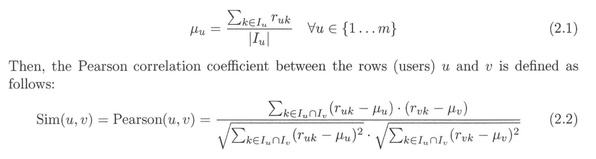 

       
*   Example of User-Based Algorithm
    
     

    *   표의 예를 고려하십시오. 
        * 5 명의 User {1 ... 5}의 등급은 {1 ... 6}으로 표시된 6개의 Item에 대해 표시, 각 등급은 {1 ... 7} 범위에서 가져옵니다. 
    
    * 목표 : User 색인이 3인 경우를 고려해보고 표의 등급을 기준으로 예측을 만들고 싶음 
        * 추천 리스트를 결정하기 위해 Item 1과 6에 대한 예측점수 R 및 User 3의 값을 계산해야함
        * 첫번째 단계는 User 3과 다른 모든 User 간의 유사성을 계산하는것, 동일한 표의 마지막 두 열에서 유사성을 계산하는 두 가지 방법을 나타냄
        *  두 번째 마지막 열은 평점 사이의 원시 코사인을 기반으로 한 유사도, 마지막 열은 피어슨 상관 계수를 기반으로 한 유사도

    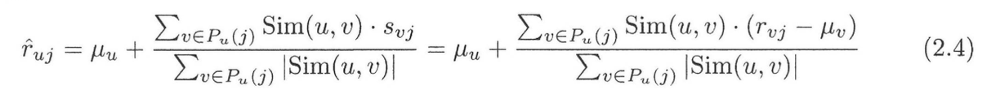 
    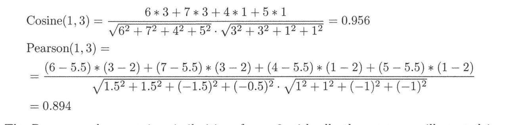 

*   피어슨 상관 계수의 부호는 유사도 및 비유사도에 대한 정보를 제공
    *   User 3에게 가장 가까운 2 User는 두 측정에 따라 User 1과 2입니다. 
    *   User 1과 2의 원 평점의 피어슨 가중 평균을 사용하면 등급이 매겨지지 않은 Item 1과 6에 대해 User 3에 대해 다음과 같은 예측이 이루어집니다.    

     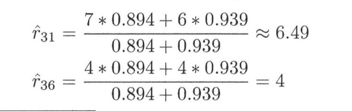 

    *  User 3이 이미 등급화한 영화보다 더 큰 값으로 영화 1 및 6 모두에 관심을 가질 것으로 예측했음
    *  그러나 User 인덱스의 피어 그룹 {1,2}이 대상 User 3과 비교하여 긍정적인 등급을 가지는 훨씬 더 "낙관적인 그룹"이라는 사실로 인해서 편향의 결과가 있음
    *  예측에 대한 평균 중심 평가는 표 2.2에 나와있다. 평균 - 중심 방정식 2.4를 갖는 상응하는 예측은 다음과 같음

    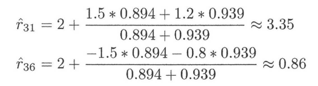 

*   따라서 평균 중심 계산은 Item 1이 Item 3보다 User 3에 대한 추천 리스트로 우선 순위가 지정되어야 한다는 예측을 제공함   
    *  그러나 이전 추천 리스트와 중요한 차이점이 있습니다. Item 6의 예상 등급은 0.86으로 User 3이 평가 한 다른 모든 Item보다 적음
    *  Item 6에 대한 예상 등급이 User 3이 평가 한 다른 모든 Item보다 더 큰 이전의 사례보다 크게 다름
    *  표를 육안으로 검사했을 때, 가장 가까운 동료 (User 1과 2)가 자신보다 낮은 점수를 매기므로 Item 6은 User 3이 매우 낮게 평가해야 한다는 것이 분명함
*  mean-centering 과정은 이미 관측된 등급에 비해 훨씬 더 나은 상대 예측을 가능하게 함
 
***

###  2.3.1.1 Similarity Function Variants

*   유사도 함수의 다른 변형이 필요, **하나의 변형은 평균 중심 평가가 아닌 원점 평점에서 코사인 함수를 사용하는 것**

    *   raw 코사인 구현은 분모의 정규화를 할 때 모든 Item을 기반으로 함
    *   일반적으로 평균 센터링의 피어슨 상관 계수는 바이어스 조정 효과 때문에 원시 코사인 값보다 바람직함

*   두 명의 User가 공통적으로 소수의 평가만을 갖는 경우
    * 유사도 함수는 해당 User 쌍의 중요성을 덜 강조하기 위해 discount 요소를 줄임 

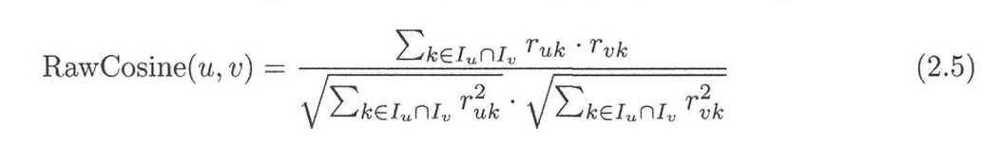 

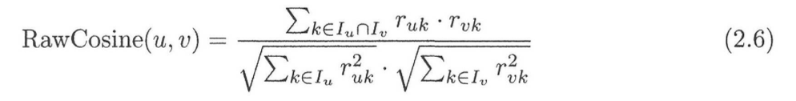 

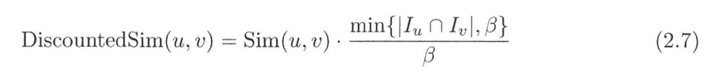 

***

###  2.3.1.2 Variants of the Prediction Function

 

*   식 2.4에 사용 된 예측 함수에는 여러가지 변형이 있음 (Z 변환)

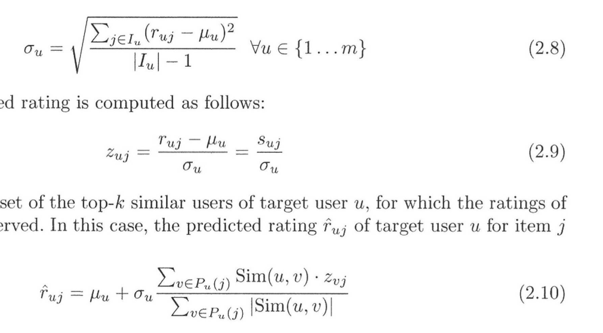 

*   등급의 정규화를 사용, "평균 중심" 또는 "Z 점수" 중에서 어떤 값이 더 높은 품질의 결과를 제공하는지 여부에 대한 다양한 연구에서 충돌하는 결론이 있음
    *   Z 점수의 한 가지 문제점은 예측된 등급이 종종 미사용 등급의 범위를 벗어날 수 있다는 것
    *   예측된 값이 미사용 등급의 범위를 벗어나는 경우에도 특정 User에 대한 바람직함의 순서로 Item을 순위 매기기 위해 사용할 수 있음

*   예측의 두 번째 이슈는 다양한 등급의 가중치
    *   Item j에 대한 User v의 각 평균 중심 등급 s Vj는 대상 User u에 대한 User v의 유사도 Sim (w, v)로 가중화
    *   Sim (w, v)의 값이 Pearson 상관 계수로 선택되었지만 일반적으로 사용되는 방법은 a의 지수화 하여 증폭하는 것
    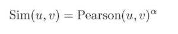 

*   **이웃기반 협업 필터링 방법은 가장 가까운 이웃 분류 / 회귀 방법의 일반화된 방법**
    * 예측 값은 연속적인 변수로 취급되기 때문에 K-NN 회귀 모델링에 더 가까움 
    * 등급을 범주 값으로 처리하고 등급 간의 순서를 무시함으로써 분류 방법에 더 가까운 예측 기능을 생성할 수 있음
    * 목표 User u의 피어 그룹이 식별되면, 피어 그룹 내의 각 가능한 등급값(예 : 동의, 중립, 불일치)에 대한 투표수를 결정
    * 가장 많은 표를 얻은 평점은 관련 투표로 예측, 접근 방식은 평균 등급보다는 가장 가능성 있는 등급을 제공하는 이점이 있음 
    * 해당 접근법은 별개의 등급이 적은 경우 일반적으로 더 효과적
        * 또한 등급값의 쌍 사이의 정확한 거리가 정의되지 않은 서수 등급의 경우에도 유용함
    *  평점의 세분성이 높은 경우 해당 접근 방식은 덜 강력하고 평점 중 많은 정보를 잃어버림

*** 

###  2.3.1.3 Variations in Filtering Peer Groups

*   ""User에 대한 피어 그룹은 다양한 방법으로 정의되고 필터링"" 될 수 있음
    *   가장 쉬운 방법은 ""User에게 최상위 / 최다 유사 User를 동료 그룹""으로 사용하는 것
    *   그러나 이러한 접근 방식에는 대상과 약하거나 음의 상관관계가 있는 User가 포함될 수 있음
    *   약한 상관 관계가 있는 User는 예측에서 에러가 추가될 수 있음
    * 또한 음의 상관 등급은 잠재적인 등급 관점에서 예측 가치가 떨어짐
    * 따라서 약하거나 부정적 상관 관계가 있는 평점은 필터링되어 제외되는 경우가 많음

*** 

###  2.3.1.4 Impact of the Long Tail

*   등급 분포는 많은 실제 시나리오에서 **긴 꼬리 분포**를 보여줌
    *   일부 영화는 매우 인기가 있을 수 있고 다른 User가 일반적으로 등급이 매겨진 Item으로 반복적으로 나타날 수 있음

*   등급은 여러 User 간에 차별성이 적기 때문에 **추천 시스템의 품질**을 악화시킬 수 있음
    *   추천 리스트의 부정적인 영향은 피어그룹 계산과 예측 계산 (표 2.4 참조)에서 모두 경험할 수 있음
    *   개념은 원칙적으로 문서 검색 애플리케이션에서의 비정보 단어(예 : "a", "an", "the")에 의해 야기되는 검색 품질의 저하와 유사함
    *   협업 필터링에 사용되는 제안된 솔루션은 정보검색 도메인에서 사용되는 솔루션과 유사함

*   Inverse Document Frequency (IDF)의 개념이 정보 검색에 존재하는 것처럼
    *   Inverse User Frequency라는 개념을 사용할 수 있음, r이 Item의 등급 수이고 m이 총 User 수이면 Item j의 가중치 Wj는 다음과 같이 설정

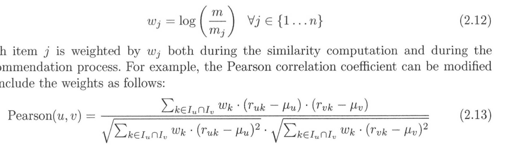 

*   각 Item j는 유사도 계산 및 추천 프로세스 중에 wj에 의해 가중치가 부여됨
    * 두 Item 간의 조정된 코사인 유사도가 가중치에 의해 변경되지 않더라도 Item 기반 협업 필터링 알고리즘의 최종 예측 단계는 가중치를 사용하도록 수정할 수 있음

***

###  2.3.2 Item-Based Neighborhood Models

* Item 기반 모델에서 피어 그룹은 User가 아닌 Item으로 구성됨, 따라서 Item (또는 등급 matrix의 열)간 유사도를 계산해야 함
    * Column 사이의 유사도를 계산하기 전 등급 매트릭스의 각 Row은 0의 중심에 집중
    * User 기반 등급의 경우와 마찬가지로 등급 매트릭스의 각 Item에 대한 평균 등급이 각 등급에서 차감되어 "평균 중심 매트릭스"가 작성

* 앞에서 논의된 방정식 (식 2.3 참조)과 동일하며 평균 중심점을 계산

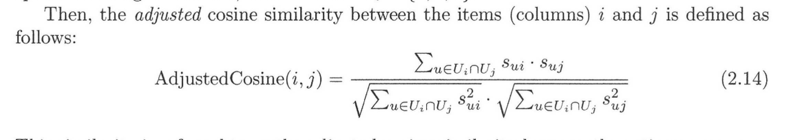 

*   Item (Column) i와 j 간의 조정된 코사인 유사성은 다음과 같이 정의됩니다.
    *  유사도 값을 계산하기전, 등급이 평균 중심이므로 조정된 코사인 유사도라고 함
    *  Item 기반 방법의 경우 Column에서 피어슨 상관 관계를 사용할 수도 있지만 조정된 코사인은 일반적으로 우수한 결과를 제공함
*   User u에 대한 목표 Item t의 등급을 결정해야 하는 경우를 고려한다면
    * 첫번째 단계는 조정된 코사인 유사도를 기반으로 Item t에 대해 가장 유사한 Item을 결정하는 것
    * User U가 등급을 지정한 Item t에 일치하는 Item을 Qt{u}라고 표시
    * (원) 등급의 가중 평균값을 예측 값으로 보고, 평균에서 Item j의 가중치는 Item j와 대상 Item t 간의 조정된 코사인 유사도와 같음. 따라서, 대상 Item t에 대한 User u의 예상 등급은 다음과 같음

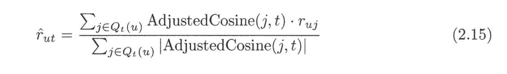 

* **기본 아이디어는 예측을 수행하는 마지막 단계에서 유사한 Item에 대한 "User 자신의 평점"을 활용하는 것**
    *  예를 들어, 영화 추천 시스템에서, 아이템 피어 그룹은 전형적으로 유사한 장르의 영화일 것, 영화에서 같은 User의 평점 기록은 해당 User의 관심을 매우 정확하게 예측
    *  Item 기반 알고리즘은 User 기반 알고리즘과 매우 유사하기 때문에 유사성 함수와 예측 함수의 비슷한 변형을 Item 기반 방법으로 설계 할 수 있음

***

#### Example of Item-Based Algorithm

* User 3의 누락된 등급은 Item 기반 알고리즘으로 예측. Item 1과 6의 등급이 User 3에 대해 누락되었기 때문에 Item 1과 Item 6에 대한 Column의 유사성을 다른 Column(Item)에 대해 계산해야 함

*  첫째, Item 간의 유사성은 평균 중심 조정을 위해 계산한 뒤에 체크
    *  평균 중심 평가 매트릭스는 표 2.2에 나와 있습니다
     
    
    *  각 Item의 상응하는 코사인 유사도는 각 1과 6으로 표의 마지막 두 행에 표시됩니다
    *  AdjustedCosine (1,3)으로 표시된 Item 1과 Item 3 사이의 조정된 코사인 값은 다음과 같습니다.

    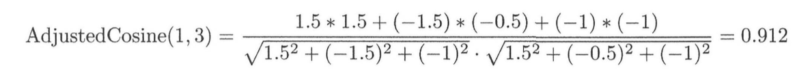 

*   다른 Item 유사성은 정확하게 유사한 방식으로 계산되며 표 2.2의 마지막 두 행에 설명되어 있음
    *  Item 2와 3은 Item 1과 가장 유사하지만 Item 4와 Item 5는 Item 6과 가장 유사함
    *  따라서 Item 2와 Item 3에 대한 User 3의 원평점의 가중 평균을 사용하여 등급을 예측, Item 4 및 5에 대한 User 3의 원평점의 가중 평균은 Item 6의 등급을 예측하는데 사용됨
    *   따라서, Item 기반 방법은 Item 1이 Item 3보다 User 3에 더 선호될 가능성이 높다고 제안  

    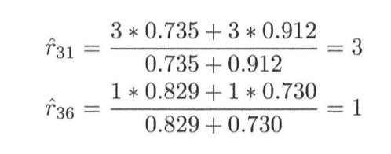 

*   등급 3은 User 3 자신의 등급을 사용하여 예측되기 때문에 예측 등급은 이 User의 다른 평점과 훨씬 일치
    *   특정 예로서, User 기반 방법의 경우와 같이 Item 6의 예상 등급이 더이상 허용 등급 범위를 벗어나지 않는다는 것이 주목할만 점
    *   Item기반 방법의 예측 정확도가 주요 이점, 경우에 따라 추천 리스트가 일반적으로 비슷할지라도 Item기반 방법은 다른 추천 리스트 집합을 제공 할 수 있음

***

###  2.3.3 Efficient Implementation and Computational Complexity

*   Neighborhood 기반 메소드는 항상 User에 대한 **최상위 Item 추천 리스트 또는 Item에 대한 최상의 User 추천 리스트**를 결정하는 데 사용됨
    *   User - Item 쌍 (예를 들어, 특정 User에 대한 모든 Item)에 대한 모든 가능한 등급 예측을 계산한 다음에 순위를 매기는 것  

*   추천시스템에서 사용되는 기본 접근 방법은 많은 User Item 조합에 대한 예측 프로세스가 중간에 많은 결과들을 재사용 하고 있기에 그것을 관찰하는 것이 중요
    *  따라서 중간 계산을 저장하고 순위 프로세스에 활용하기 위해 오프라인 단계를 사용하는 것이 좋음

*   이웃기반 방법은 항상 **오프라인 단계**와 **온라인 단계**로 구분됨
    * 오프라인 단계에서 User (또는 Item - Item) 유사도 값 및 User (또는 Item)의 피어 그룹이 계산됨 
    * User (또는 Item)에 대해, 피어 그룹은 이 계산에 기초하여 미리 저장됨 
    * 온라인 단계에서 유사도 값과 피어 그룹을 활용하여 식 (2.4)와 같은 관계를 사용하여 예측을 수행. n을 User(Row)의 지정된 등급의 최대수로, m은 Item(Column)의 지정된 등급의 최대수를 의미 
    *  n은 한 쌍의 User(행) 사이의 유사도를 계산하기 위한 최대 실행시간이며 한쌍의 Item(Column) 간의 유사도를 계산하기 위한 최대 실행시간
        * k의 값을 다양하게 하는 접근법을 사용하려면 User(또는 Item) 쌍 사이에 0이 아닌 유사성 쌍을 모두 저장해야 함
    *  User 수는 일반적으로 Item 수보다 많기 때문에 User 기반 방법의 공간 요구 사항은 일반적으로 Item 기반 방법의 공간 요구 사항보다 큼

*   반면, 판매자는 가끔 특정 Item에 대해 타겟팅할 최상위 User를 결정할 수도 있음
    *   모든 User가 대상, Item에 대해 순위를 매기려면 예측을 실행해야 함
    *   결과적으로, 이웃기반 방법은 온라인 예측에 사용될 때 효율적이 되는 경향이 있음. 결국, 오프라인 단계에서 훨씬 더 많은 계산 시간을 할당해도 됨

*** 

###  2.3.4 Comparing User-Based and Item-Based Methods

*   Item 기반 방법은 종종 User 자체 등급을 사용하여 추천 리스트를 수행하기 때문에 보다 **관련성이 높은 추천 리스트**를 제공함
    * 예를 들어, 대상 이력 영화와 유사한 Item은 다른 역사적인 영화의 집합일 수 있음. 유사 세트에 대한 User 자신의 추천 리스트는 대상에 대한 선호도를 크게 나타낼 수 있음
    * 중첩되지만 서로 다른 이해 관계가 있는 다른 User로부터 등급이 추정되는 User 기반 방법의 경우는 아님. 결과적으로 Item기반 방법은 더 나은 정확성을 나타냅니다.

*  Item 기반 추천 리스트는 종종 정확할 가능성이 더 높지만 Item 기반 방법과 User 기반 방법 간의 상대적 정확도는 현재 **설정 중인 데이터**에 따라 다름
*  아이템 기반 방법은 추천 시스템에서 실링 (shilling) 공격에 더 강력함 
    * 반면에 Item 기반 방법에 비해 User 기반 방법의 추천 프로세스가 다양해질 수 있음
    * 다양성은 순위가 매겨진 목록의 Item이 다소 다른 경향이 있다는 사실을 나타냄. 
    * **Item이 다양하지 않은 경우 User가 첫번째 Item을 좋아하지 않으면 목록의 다른 Item**도 마음에 들지 않을 수 있음 
        *   큰 다양성은 또한 뜻밖의 발견을 장려하는데, 그로 인해 다소 놀랍고 흥미로운 Item이 발견됨
*  아이템 기반 메쏘드는 명백한 아이템이나 이전 User 경험에서 새로운 것이 아닌 아이템을 추천하기도 함
    *   참신함, 다양성 의미에 대한 개념은 7장에서 자세하게 논의, 참신함, 다양성 및 중요성이 충분하지 않으면 User는 이미 본 내용과 매우 유사한 추천 리스트에 지루할 수 있음
*   **Item 기반 방법은 추천 리스트에 대한 구체적인 이유를 제공할 수 있음**. 예를 들어, Netflix는 종종 다음과 같은 진술로 추천 리스트을 제공합니다.
   
    > Because you watched “Secrets of the Wings  ’’[the recommendations are] (List).

*   반면에, 설명은 피어그룹이 단순히 익명 User 집합이며 추천 프로세스에서 직접 사용할 수 없기 때문에 User 기반 방법으로는 해결하기가 더 어려움
*   User 기반 방법은 다양한 유형의 설명을 제공, 예를 들어 영화 Terminator, Alien 및 Predator가 Alice에게 권장되는 시나리오를 고려해보십시오. 
    *   영화에 대한 이웃의 등급에 대한 히스토그램을 표시 할 수 있음, 히스토그램의 예가 그림 2.2에 나와 있음

    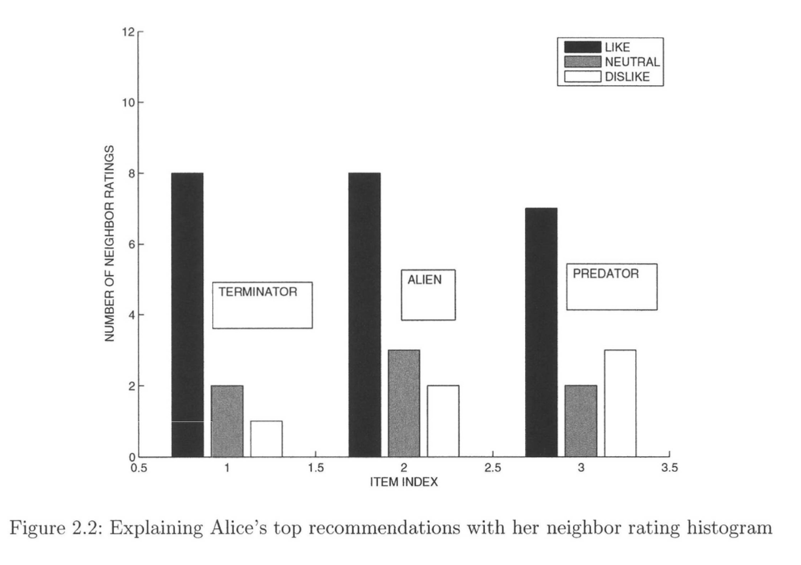 

    *   히스토그램은 유형의 설명은 앨리스에게 영화가 자신의 취향이나 실제로 알고있고 신뢰하는 친구의 영화와 어떤 관련이 있는지에 대한 아이디어를 제공하지 않기 때문에 다소 제한적
        *   그녀의 이웃들의 신분은 프라이버시에 대한 우려 때문에 일반적으로 사용할 수 없다는 점에 유의

*   마지막으로, **Item 기반 방법은 등급을 변경하면 보다 안정적**인데 두가지 이유 때문
    * 첫째, User 수는 일반적으로 Item 수보다 훨씬 큼
    * 두 명의 User가 상호 등급이 매우 낮은 Item을 가질 수 있지만 두 Item은 공동 평가한 User가 더 많을 수 있음
        * User 기반 방법의 경우 몇 가지 등급을 추가하면 유사성 값을 크게 바꿀 수 있음
        * 등급 기반의 변경에 보다 안정적인 Item 기반 방법의 경우는 그렇지 않음
    *  둘째, 신규 User는 시스템에서 새 Item보다 더 자주 추가될 것
        * 인접Item 계산은 가끔씩만 수행 할 수 있음. 새 User를 추가하면 Item 이웃이 크게 변경 될 가능성이 적기 때문 
        * 반면에, 새로운 User가 추가됨에 따라 User 인접 지역의 계산이 더 자주 수행되어야 함 
        * 맥락에서 User 기반 방법의 경우 추천 모델의 점진적 유지 관리가 더욱 어려워짐  

*** 

###  2.3.5 Strengths and Weaknesses of Neighborhood-Based Methods

*  이웃 방식은 단순성과 직관적인 접근과 관련하여 몇 가지 장점
    * 간단하고 직관적인 접근 방식 때문에 구현 및 디버그 하기가 쉬움
    * 특정 Item을 추천하는 이유를 정당화하기 쉽고 Item기반 방법의 해석 가능성이 특히 두드러짐
    * 또한 추천 리스트는 새로운 Item과 User가 추가되어 상대적으로 안정적

*  주된 단점은 오프라인 단계가 때로는 대규모 설정에서 실용적일 수 있다는 것
    *  User 기반 방법의 오프라인 단계에는 적어도 m^2 시간과 공간이 필요
    *  m이 수천만에 달하는 경우 데스크톱 하드웨어에서 너무 느리거나 공간 집약적인 경우가 있음
    *  희소성 때문에 제한된 범위에 있다는 것
        * 예를 들어, John의 가장 가까운 이웃 중 누구도 Terminator를 평가하지 않으면 John의 Terminator에 대한 등급 예측을 제공 할 수 없음
            *  반면에 우리는 대부분 John의 top-K : Item에만 관심이 있음
            *  John의 가장 가까운 이웃 중 누구도 Terminator를 평가하지 않으면 이 영화가 John에게 좋은 추천이 아님을 입증할 수 있음
    *  Sparsity는 **두 User 간의 상호 평가 Item 수가 적은 경우에도 견고한 유사성 계산**을 위한 과제를 만듦

*** 

###  2.3.6 A Unified View of User-Based and Item-Based Methods

* User 기반 및 Item 기반 방법의 약점 
    * 전자 (User 기반)가 등급 매트릭스의 Column 사이의 유사성을 무시하는 반면
    * 후자 (Item 기반)는 가장 유사한 Item을 결정하는 동안 Row 간의 유사성을 무시한다는 사실에서 비롯

* 두 가지 방법을 통합하여 대상 Item과 가장 유사한 Item을 결정할 수 있는지 여부에 따라 달라짐
    * Row나 Column의 유사성을 무시할 필요가 없음
    * 오히려 Row나 Column 사이의 유사성 정보를 결합할 수 있음

* 목표를 달성하려면 **Row가 평균 중심으로 설정되면 User 기반 및 Item 기반 방법이 거의 동일**하다는 점 (사소한 차이가 있음)을 이해하는 것이 중요
    *  일반성의 손실 없이 예측 행렬의 Row가 평균 중심으로 가정할 수 있음
    * 왜냐하면 예측 후 각 Row의 평균을 각 Item에 다시 추가할 수 있기 때문
    * 또한 Row이 평균 중심이면 Row 사이의 피어슨 상관 계수가 코사인 계수와 동일하다는 점도 주목할 만함

*  가정에 기초하여 User 기반 및 Item 기반 방법을 통합하여 평가 매트릭스 R에서 Item Uj를 예측할 수 있음
    * 대상 엔트리 (u, j)에 대해 Row / Column 사이의 코사인 계수를 사용하여 가장 유사한 Row / Column을 결정합니다. 
        * User 기반 메서드의 경우 행이 사용되는 반면 Item 기반 메서드의 경우 열이 사용됨
    * 첫 번째 단계에서 결정된 가장 유사한 Row / Column의 등급의 가중치 조합을 사용하여 대상 Item (u, j)을 예측  

* 각 단계에서 Row or Column을 무시한다는 점에 유의하십시오. 물론 Row와 Column을 따라 유사도와 예측 정보가 결합된 전술한 단계의 일반적인 설명을 제안할 수 있음
    * 대상 Item (u, j)에 대해 Row과 Column을 간의 유사성의 조합 기능을 사용하여 등급 매트릭스의 가장 유사한 Item을 결정합니다. 
        * 예를 들어, Row 사이의 코사인 유사성의 합계를 사용하여 평가 매트릭스에서 (u, j)와 가장 유사한 Item을 결정할 수 있음.
    * 첫 번째 단계에서 결정된 가장 유사한 Item의 등급의 가중치 조합을 사용하여 대상 Item (u, j)을 예측. 가중치는 첫 번째 단계에서 계산된 유사성을 기반으로 함
*   일반화된 방법에서 다른 단계를 강조. 이 접근법은 조합 기능을 사용하여 Row / Column을 따라 유사점을 융합함
    *   가장 효과적인 결과를 얻기 위해 다양한 조합 기능을 사용하여 실험 할 수 있음
    *   기본 원칙은 User, Item 및 기타 상황 별 차원의 유사성이 단일 프레임 워크로 통합되는 상황 별 권장 시스템의 다차원 모델에서도 사용됨

*** 

###  2.4 Clustering and Neighborhood-Based Methods

* 이웃기반 방법의 주요 문제점은 **오프라인 단계의 복잡성으로 User 수나 Item 수가 매우 많은 경우** 중요함
    * 예를 들어 User m의 수가 약 수억 명에 이르면 User 기반 방법의 실행 시간은 가끔씩 오프라인 계산을 하더라도 비실용적

* 클러스터링 기반 방법의 주요 아이디어는 **오프라인으로 가장 가까운 이웃**을 대체하는 것
    *  오프라인의 가장 가까운 인접 단계가 다수의 피어 그룹을 생성하는 것처럼, 가능한 타겟에 중심이 맞추어지기 때문에, 클러스터링 프로세스는 피어 그룹의 수를 더 작게 만들며, 피어 그룹은 각 가능한 타겟에 센터링 될 필요는 없음
    * 클러스터링 프로세스는 모든 가능한 대상의 피어 그룹을 구성하는 데 필요한 시간보다 훨씬 효율적
    * 일단 클러스터가 구성되면, 등급 예측 프로세스는 수식 2.4에서 사용된 접근법과 유사함
    * 주요 차이점은 동일한 클러스터 내의 가장 가까운 피어가 예측을 수행하는 데 사용된다는 것. **pairwise 유사성 계산은 동일한 클러스터 내에서만 수행되어야 하므로** 접근법이 훨씬 더 효율적일 수 있다는 것이 주목할 가치가 있음 
    * 이 효율성은 클러스터 내의 각 대상에 가장 가까운 이웃 집합이 **전체 데이터보다 낮은 품질을 가지므로 정확성이 다소 떨어짐**
        * 또한 클러스터링 세분성은 정확도와 효율성 간의 균형을 조절합니다. 클러스터가 세분화되면 효율성은 향상되지만 정확도는 떨어짐

*  대부분의 경우 정확도를 약간 낮추면 효율성 면에서 매우 큰 이득을 얻을 수 있습니다. 등급 매트릭스가 매우 클 경우 이 접근법은 적은 비용으로 매우 실용적인 대안을 제공
    * 클러스터링 방법은 불완전한 데이터 세트로 작업할 수 있어야 함
    * k-means 방법은 불완전한 데이터에 쉽게 적응할 수 있음. k-means 접근법의 기본 아이디어는 k 개의 다른 클러스터의 대표점 역할을 하는 k 개의 중심점 (또는 "수단")으로 작업하는 것
        * 평균 방법에서, 클러스터링에 대한 해는 이러한 k 대표들의 명세에 의해 완전히 표현될 수있음
    * 각의 데이터 포인트는 유사도 또는 거리 함수를 사용하여 가장 가까운 대표점에 할당. 따라서 데이터 파티셔닝은 대표점 세트에 의해 고유하게 정의 될 수 있음
    * m x n 데이터 집합의 경우 각 대표 Yi는 i번째 클러스터의 중심점인 n차원 데이터 점, 이상적으로는 중앙 대표가 클러스터의 평균이 되고 싶음

* k-means 방법을 사용할때의 주된 문제점은 m x n 등급 매트릭스가 불완전하다는 것. 따라서 평균값과 거리 값의 계산은 정의되지 않음 
    *  그러나 클러스터 내에서 관측된 값만을 사용하여 평균을 계산하는 것은 상대적으로 쉬움
    *  경우에 따라 클러스터의 하나 이상의 Item에 대해 등급이 지정되지 않은 경우 중심점 자체가 완전하게 지정되지 않을 수 있음
    *  거리 값은 차원의 하위 집합만 사용하여 계산되며 데이터 요소와 클러스터 표현에 대해 모두 지정. 또한 거리는 계산에 사용된 차원 수로 나뉨 
    *  모든 중심이 완전히 지정되지 않은 경우 여러 개의 중심점에 대한 데이터 요소의 거리를 계산하기 위해 서로 다른 개수의 차원이 사용된다는 사실을 조정하기 위해 수행됨
    *  맨해튼 거리는 유클리드 거리보다 더 나은 조정을 산출하며, 정규화된 값은 각 관측된 값을 따라 평균 거리로서보다 쉽게 해석 될 수 있음

* **User 기반 협업 필터링을 위해 Row를 클러스터링 함. Item 기반 방법에서는 Column을 클러스터링 해야 함**
    *   이 방법은 Row를이 아닌 Column에 적용된다는 점을 제외하고는 완전히 유사합니다. 
    *   메소드 중 일부는 User 기반 메소드이고 다른 메소드는 Item 기반 메소드. 여러 개의 동시 클러스터링 방법을 사용하여 Row과 Column을 동시에 클러스터링 할 수도 있음

   